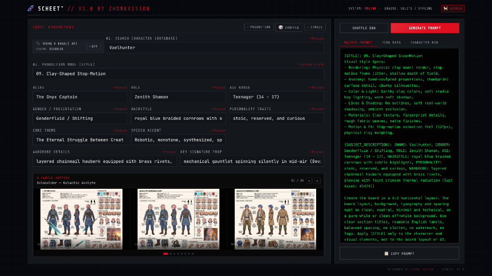
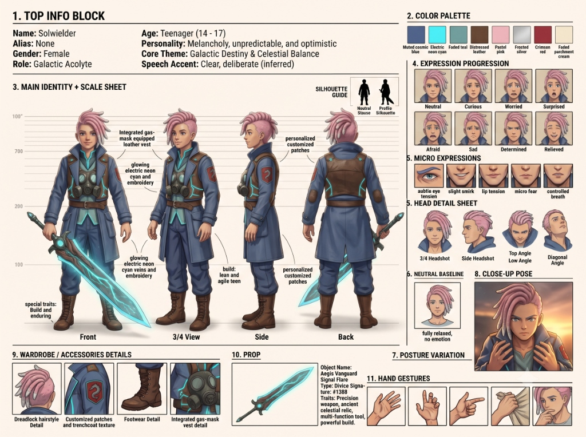
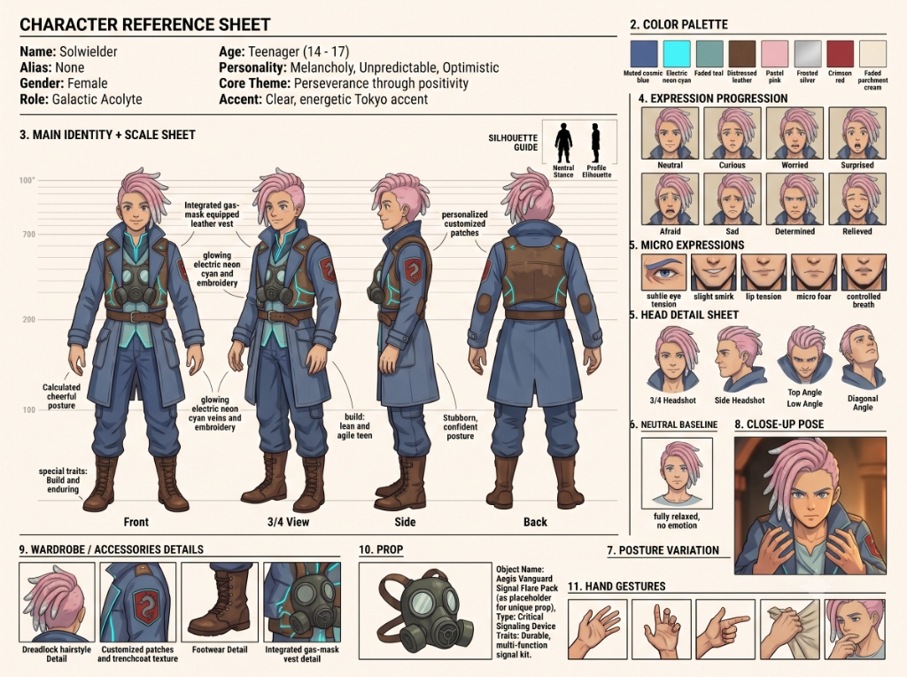
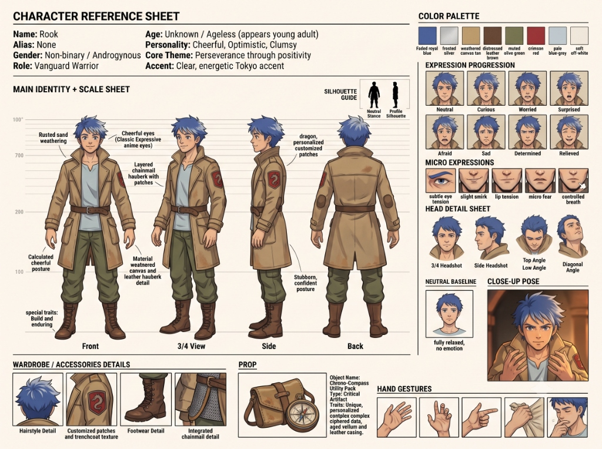
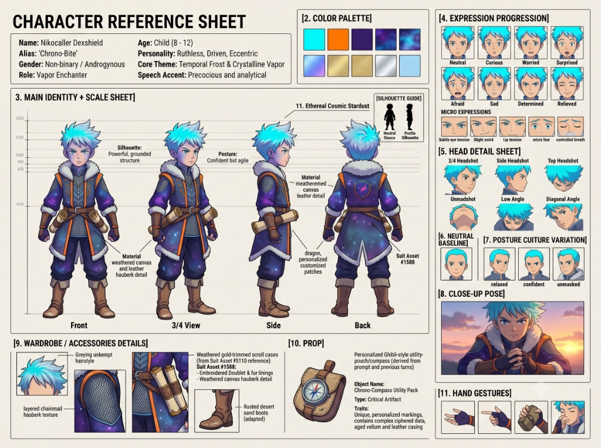
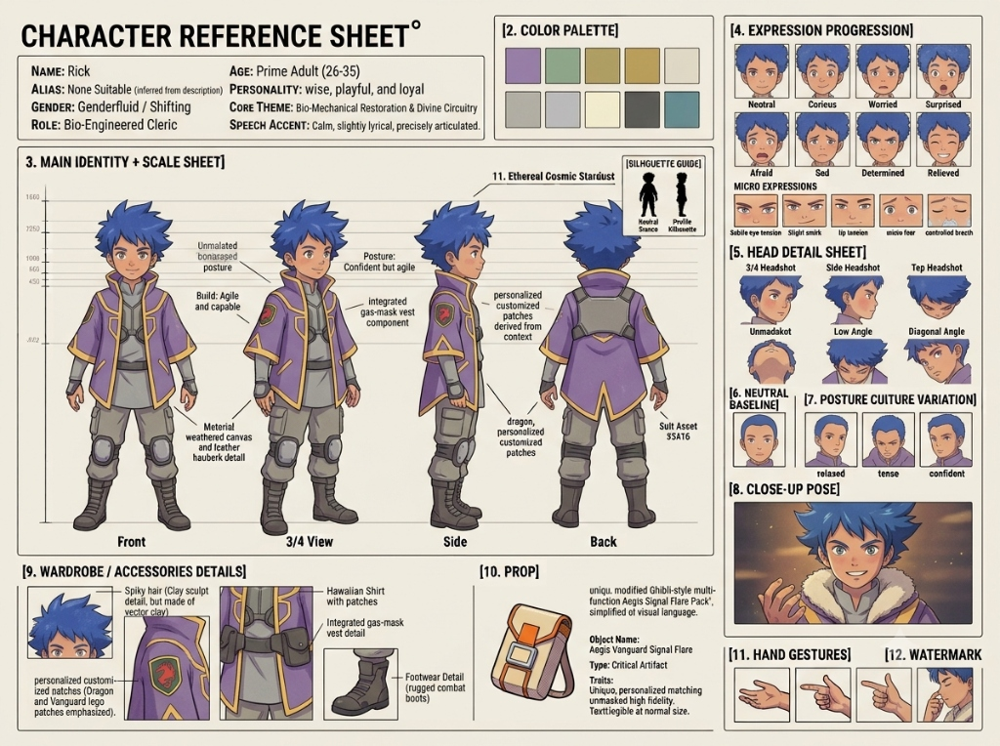
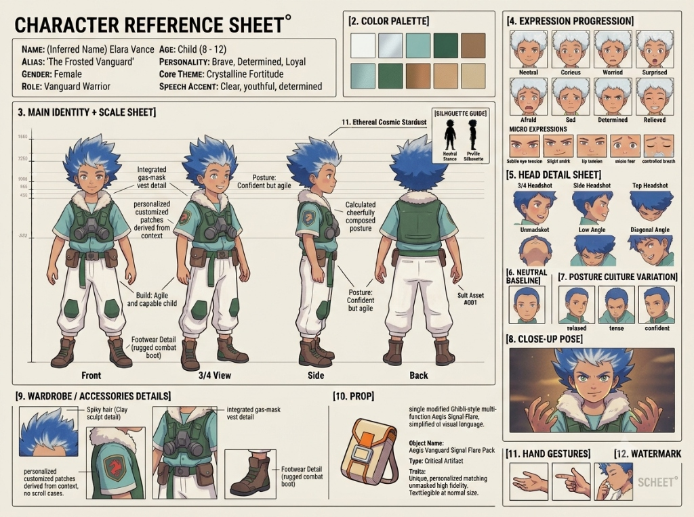
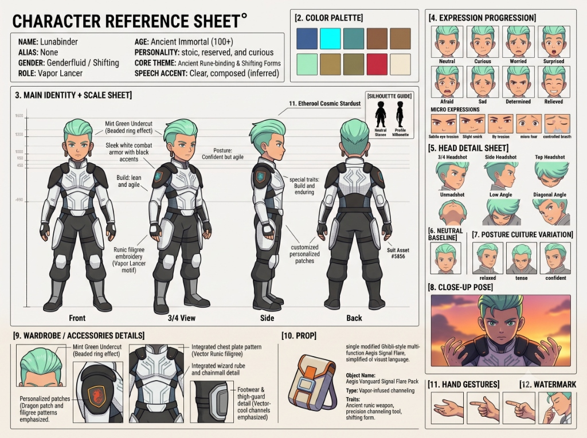
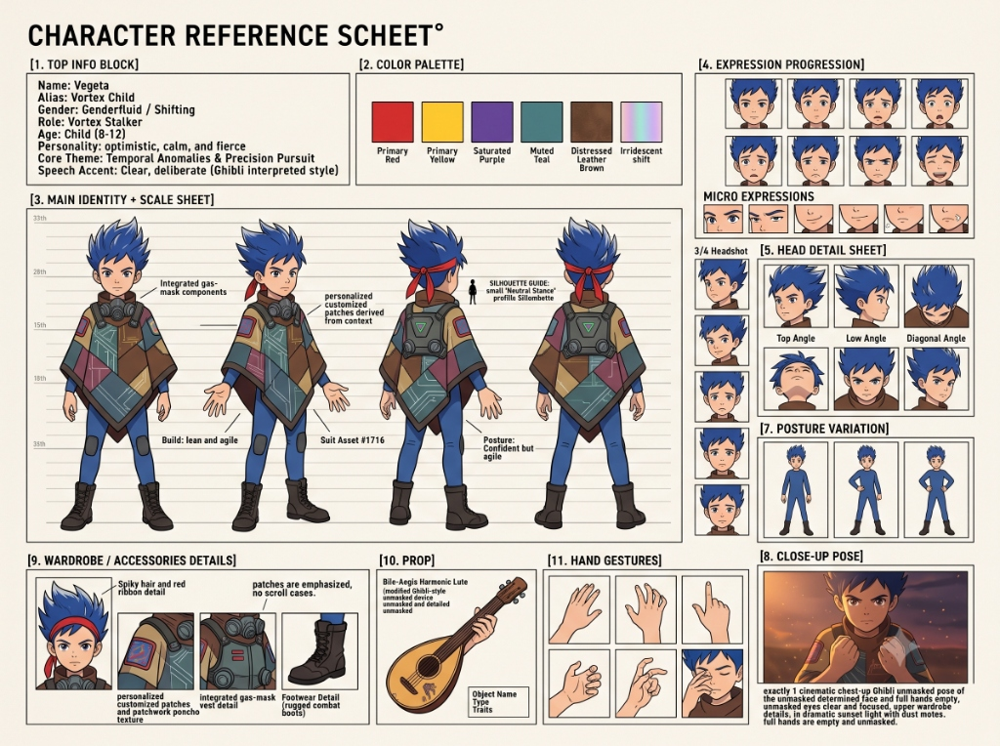
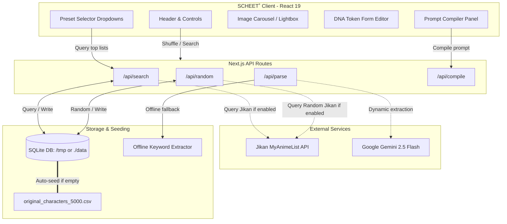

# 🧬 SCHEET˚

> Premium Dark-Monospace Character Sheet Prompt Compiler & DNA Splicing Engine. Fully optimized for responsive desktop grid workflows.

<p align="left">
  <a href="https://scheet.vercel.app" target="_blank" rel="noopener noreferrer">
    
  </a>
</p>



---

## ◈ GALLERY / SAMPLES

Here are sample character sheet prompt outputs compiled using SCHEET˚ and rendered under the **AAA Cinematic 3D Production Mode**:

<p align="center">
  
  
  
  
</p>
<p align="center">
  
  
  
  
</p>

---

## ◈ SYSTEM ARCHITECTURE

SCHEET˚ operates on a hybrid Serverless API + Local SQLite architecture designed for high availability, zero latency, and production safety.



### Key Architectural Flows:
1. **Dynamic Seeding**: If the SQLite database is empty on cold-starts (specifically in serverless environments like Vercel), it dynamically parses `original_characters_5000.csv` and populates the database automatically.
2. **Hybrid Search & Shuffle**: Search queries and random shuffles query the local SQLite database. If the Jikan MAL API toggle is engaged, queries fetch from online sources and save them directly to the database.
3. **Fail-safe Tokenizer**: Bio parsing is processed through the `/api/parse` route. If `GEMINI_API_KEY` is not present, it automatically falls back to the local regex-based keyword parser for instant offline token generation.

---

## ◈ TECH STACK

- **Core Framework**: Next.js 16 (App Router / Turbopack)
- **Language**: TypeScript
- **Database Engine**: SQLite via `better-sqlite3` (with WAL journaling enabled for high-performance concurrent writes)
- **Logic Parsers**: Regular Expressions (Offline Keyword Extractor) + Google Generative AI (`gemini-2.5-flash` API wrapper)
- **Styling system**: Custom Monospace Cyberpunk CSS Grid with 125% scale density
- **Host / CD**: Vercel Serverless (with dynamic `/tmp` database path resolution)

---

## ◈ STEP-BY-STEP TUTORIAL

### 1. Initial Setup & Launch
First, install the repository and dependencies:
```bash
# Clone the repository
git clone https://github.com/zhonkvision/scheet.git
cd scheet

# Install dependencies
npm install

# Initialize and seed the SQLite database with 5,000 characters
npx tsx scripts/seed-db.ts

# Launch the compiler
npm run dev
```

### 2. Splicing Character DNA (Dual Splicing Mode)
1. Turn on **SPLICER** in the top control panel.
2. Type a character name in **Search Subject Alpha (A)** and select one from the dropdown (e.g. *Goku*).
3. Type a character name in **Search Subject Beta (B)** and select another character (e.g. *Vegeta*).
4. Watch the Splicer merge their visual attributes and background details into the token editor fields.

### 3. Procedural Randomization (The Asset Library)
* **Single Field presets**: Click the **Preset** button in any parameter label (like *Role*, *Theme*, or *Prop*) to search and select from 5,000+ hand-crafted aesthetic variables.
* **Global Randomization**: Click the **🎲 SHUFFLE** button next to the splicer toggle. It will load fully randomized character DNA matching your active online/offline toggle settings.

### 4. Compiling and Exporting
1. Select a cinematic style from the **Style Preset** dropdown (e.g. *AAA Cinematic 3D*).
2. Click **COMPILE SCHEET˚**.
3. View your production prompt, raw JSON tokens, or merged biography text.
4. Click **COPY TO CLIPBOARD** to copy the generated data.

